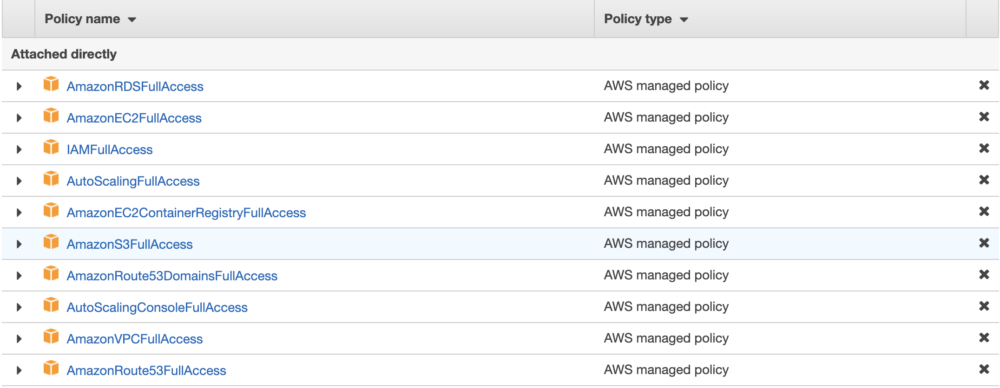

# infrastructure-as-code

Infrastructure As code Using Ansible, Packer &amp; Terraform

## Pre-requisites

- Install following tools:
    1. [Terraform](https://www.terraform.io/downloads.html): For Infrastucture Provisioning
    2. [Packer](https://www.packer.io/intro/getting-started/install.html): For Image Building
    3. [Ansible](https://docs.ansible.com/ansible/latest/installation_guide/intro_installation.html): For Image Configuration


## Getting Started
1. Clone repository
    ```sh
    git clone https://github.com/rjsaran/infrasturcture-as-code
    cd infrasturcture-as-code
    ```

2. Create An IAM Role with atleast following permissions.
    <p align="center">
        
    </p>

3. Download AWS access key and secret key for above user and store into ~/.aws/credentials.
    ```
    [default]
    aws_access_key_id=<AWS_ACCESS_KEY_ID>
    aws_secret_access_key=<AWS_SECRET_ACCESS_KEY>
    ```
